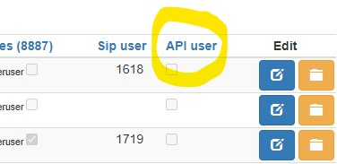

# getting-started
Describes how to start using Telemagic APIs.

## Important concepts in Telemagic API 

**Telemagic / TMG**: The company who develops and maintains the system. 

**Agent**: a user in the system. 

**Site-owner**: the company who uses the system and administrates the agents and the activity on the site. 

**Business client**: A company which the site-owner does work for.  

**Project**: a group of jobs which typically have the same client. Products are defined and associated with the project. A project can be connected to a client. 

**Job**: A job has a set of addresses or “end customers” which should be contacted or have been contacted, together with related contact information, sales data. Agents can be accredited to work on a job. Agents have access to customer data on jobs where they have been given access. 

**Address**: information about an entity – a private person or a company. Each address is connected to a single job.  

**Address list**: a collection of addresses which is typically imported into the system. Often it is the client who provides address lists which are imported into the system to do a specific task; do predictive calls, handle support tasks for a customer base, etc.

## Create an API agent / user 
  
The superusers on the TMG site can create and manage API users. 

In Administration > Agent > Overview, create a new agent. We recommend using a strong password. 

After the agent is created, edit the agent and check the "API user" checkbox, then save.



Set appropriate access for the agent by using the roles in Agent Overview combined with setting which jobs the agent should have access to. This allows you to specify that the API-agent should only have access to the relevant jobs.  

Note that agents with the following roles have access to all jobs: **admin** and **superuser**.  

## General guidelines for API usage 

TMG expects the API agents to behave nicely. If an API query takes a long time, consider reducing the data you ask for, split it in more requests which are sent one by one for example. Query with a sensible frequency. The same applies if you need to upload data. 

If TMG monitoring system catches that an API agent is over-using the API, we will try to contact the administrator to discuss whether this is needed or not. Extraordinary load caused by API usage can result in extra costs. We will inform you in these cases. In certain circumstances we will block API users when they are causing problems for the normal operation on the TMG site. 

If you are in doubt whether your planned API interaction is “nice”, please contact us and we will help you find the best solution. 


## Authentication and authorization 

The API uses **basic authentication**.  

Access to resources is determined by user role and which jobs the agent is accredited to.  


## API documentation 

Our API has detailed documentation online: 

    https://<site-name>.telemagic.no:8894/rest/ 

For each endpoint it is mentioned the user roles which are permitted to use it, parameters and responses. 


## Examples for the most typical API scenarios 

In this section the most typical scenarios is described.  


### Import addresses 

This example shows how to import addresses into the system. It is a shell script which shows how to add a list of customers to a job.

```
LINK to API docs: https://<YOUR_SITE_NAME>.telemagic.no:8894/rest/#1316391243
```

It is a two-step process:  

1. Initial request which uploads the list of addresses 
1. Second request to check whether the upload was successful.  

The reason it is done this way, is that you might upload very many addresses which the server needs time to process, imagine thousands of addresses.  

TMG will start an upload job in the background with the addresses provided in the body. A 200 response on 1) tells the job was started successfully, not whether it is able to import successfully. In order to check whether the upload is a success or not, you need to check the status of the upload job in 2). 


``` 
#!/usr/bin/env bash 

echo 'Sending to TMG, note the upload report ID in the response' 

SITE_NAME=tmg_site_name 
PROJECT_NAME=the_project_name_in_tmg 
JOB_NAME=the_job_name_in_tmg 

USER_NAME=your_tmg_user_name 
PASSWORD=your_tmg_password 


# 1) upload the addresses 
UPLOAD_REPORT_ID=`curl -u $USER_NAME:$PASSWORD -X POST  https://$SITE_NAME.telemagic.no:8894/rest/addresslist/project/$PROJECT_NAME/job/$JOB_NAME/json \ 
-H 'Content-Type: application/json' \ 
-d @example_body_with_one_customer.json` 

echo  
echo 'Using the upload report ID below, to check whether the upload was successful' 
echo 'You might need to retry this if you uploaded many addresses. Here we sleep 1 sec, to be sure it is done' 
sleep 1 

# 2) check whether the upload was a success 
curl -u $USER_NAME:$PASSWORD https://$SITE_NAME.telemagic.no:8894/rest/addresslist/report/$UPLOAD_REPORT_ID/ \ 
-H 'Content-Type: application/json' 

```

Below is the contents of the file *example_body_with_one_customer.json*. 

 
```
[ 
   { 
      "customerField":{ 
         "ticket":"abc123",
         "whatever":"something or anything"
      },
      "phoneNo":"+4712312",
      "country":"Norway",
      "name":"Ola",
      "eMail":"ola@nordmann.com",
      "lastName":"Nordmann",
      "address":"South street 1",
      "zip":"1234",
      "city":"City name",
      "company":"Green Company",
      "companyContact":"Kontact K",
      "companySector":"Sector S",
      "customerId":"some-ext-id-1",
      "gender":"Male",
      "customerNote":"customer note 1",
      "sessionNote":"session note 1"
   }
]
```
 

In order to check whether the upload is a success or not, you need to check the status of the upload job, see 2). Example response can be like this, in case there was a failure: 

 
```
{ 
   "id":1399,
   "project":"x",
   "job":"y",
   "duplicate":[ 

   ],
   "error":{ 
      "id":3922,
      "uploadId":1399,
      "entryCount":1,
      "result":"error",
      "duplicateProject":null,
      "duplicateJob":null,
      "contentType":"json"
   },
   "created":"2018-02-15T07:39:18.000+0000",
   "uploadedBy":"ApiCalls",
   "state":"completed"
}
```

Note that phoneNo is required, the rest can be omitted. The fields inside *customerField* can be whatever you want, they are custom. When you design how the customer card should look, you can refer to these field names – and they will show up with the values you imported. 
