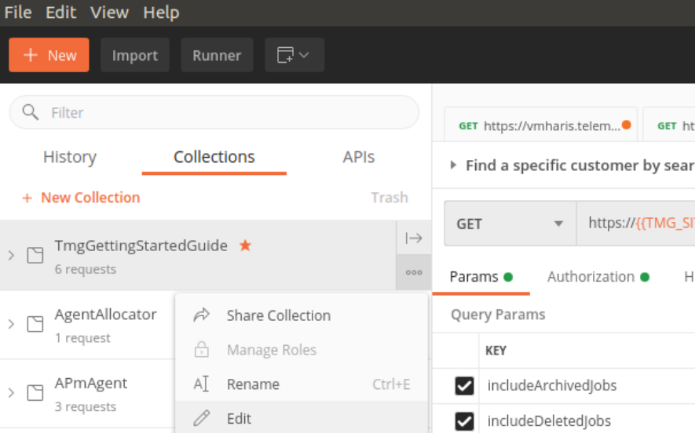

# getting-started
Describes how to start using Telemagic APIs.

## Important concepts in Telemagic API 

**Telemagic / TMG**: The company who develops and maintains the system. 

**Agent**: a user in the system. 

**Site-owner**: the company who uses the system and administrates the agents and the activity on the site. 

**Business client**: A company which the site-owner does work for.  

**Project**: a group of jobs which typically have the same client. Products are defined and associated with the project. A project can be connected to a client. 

**Job**: A job has a set of addresses or “end customers” which should be contacted or have been contacted, together with related contact information, sales data. Agents can be accredited to work on a job. Agents have access to customer data on jobs where they have been given access. 

**Address**: information about an entity – a private person or a company. Each address is connected to a single job.  

**Address list**: a collection of addresses which is typically imported into the system. Often it is the client who provides address lists which are imported into the system to do a specific task; do predictive calls, handle support tasks for a customer base, etc.

## Create an API agent / user 
  
The superusers on the TMG site can create and manage API users. 

In Administration > Agent > Overview, create a new agent. We recommend using a strong password. 

After the agent is created, edit the agent and check the "API user" checkbox, then save.

Set appropriate access for the agent by using the roles in Agent Overview combined with setting which jobs the agent should have access to. This allows you to specify that the API-agent should only have access to the relevant jobs.  

Note that agents with the following roles have access to all jobs: **admin** and **superuser**.  

## General guidelines for API usage 

TMG expects the API agents to behave nicely. If an API query takes a long time, consider reducing the data you ask for, split it in more requests which are sent one by one for example. Query with a sensible frequency. The same applies if you need to upload data. 

If TMG monitoring system catches that an API agent is over-using the API, we will try to contact the administrator to discuss whether this is needed or not. Extraordinary load caused by API usage can result in extra costs. We will inform you in these cases. In certain circumstances we will block API users when they are causing problems for the normal operation on the TMG site. 

If you are in doubt whether your planned API interaction is “nice”, please contact us and we will help you find the best solution. 

## Authentication and authorization 

The API uses **basic authentication**.  

Access to resources is determined by user role and which jobs the agent is accredited to.  

## API documentation 

Our API has detailed documentation online: 

    https://<site-name>.telemagic.no:8894/rest/ 

For each endpoint it is mentioned the user roles which are permitted to use it, parameters and responses. 

## Postman collection

Postman is an useful tool for working with and testing new APIs.

We have created a postman collection of useful API examples for you to test
Download the .json file under the **postman_collection** folder and 
import it as a collection using the **Import** button.

After importing the collection you should edit its variables.

    Go to: Edit > Variables

Change the Current Value columns, so they match your site, 
username, password, project, job etc.

|Variable|Where to find the value|
|--------|-------|
|TMG_API_USER| TMG Admin > Agent > Overview > Create a API user |
|TMG_API_PASSWORD | Password for the created api user |
|TMG_SITE_NICK| If site url is https://demo.telemagic.no:8894 then set **demo** as a value here |
|TMG_PROJECT| A project to test with|
|TMG_JOB| A job to test with, remember to give the API user access to the job|

## Examples for the most typical API scenarios 

In this section the most typical scenarios is described.  

- [Import Addresses](./scenarios/1-scenario-ImportAddresses.md)
- [Update Existing Customers](./scenarios/2-scenario-UpdateExistingCustomer.md)

## Asking for help

When contacting us about API issues, we are usually able to help faster 
if you send us the complete request and response.

Send a mail to: support@telemagic.no
